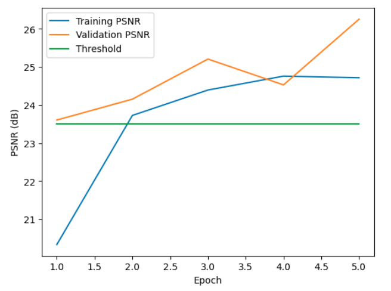

# Low-Light Image Denoising Project

## Overview
This project focuses on enhancing low-light images by reducing noise and converting them into high-light images. The main metric used for evaluating the improvement is the Peak Signal-to-Noise Ratio (PSNR).

## Dataset
- **Total Images**: 485 sets of paired images
- **Structure**: Each set includes one low-light image and one high-light image

## Exploratory Data Analysis (EDA)
- Plotted percentiles of low-light and high-light images
- Significant correlations (≥ 0.6) observed between percentiles
- Quantile regression model and XGBoost regressor used for histogram mapping


*Figure 1: Histogram Comparison*

## Key Techniques
1. **Preprocessing**: Initial convolutional operations to extract features
2. **Special Convolutional Module**: Inception-like structure with added pathways and residual learning
3. **Output Layer**: Final convolutional operations followed by sigmoid activation


*Figure 2: Model Architecture*

## Training
- **Loss Function**: Combination of Mean Squared Error (MSE) and Mean Absolute Error (MAE)
- **Optimizer**: AdamW with learning rate scheduler
- **Early Stopping**: Stops training if validation loss does not improve for 5 epochs
- **Mixed Precision Training**: Utilizes torch.cuda.amp.GradScaler for performance

## Results
- Achieved a PSNR score of 25.10 after 5 epochs


*Figure 3: Image Enhancement Results*

## Installation
To install the required packages, run:
```bash
pip install -r requirements.txt
